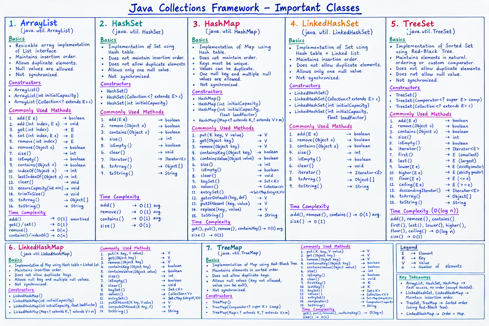

<meta name="google-site-verification" content="A15hghSg-FVv1AkZxRY9xrm3MW-vENzOoi7ZMPfStmw" />

<h3 style="display:inline;">🔣 Data Types, Conditional Stmts, Operators and Loops</h3>

   

Data types are important because they determine what kind of data you can store, how much memory it uses, and what range of values it can handle.

For competitive coding, choosing the correct data type helps you:

<ul style="margin-top:0; margin-bottom:12px; padding-left:20px;">
  <li style="margin-bottom:4px;">⚡ <strong>Avoid overflow</strong> — e.g., use <code>long</code> for very large numbers.</li>
  <li style="margin-bottom:4px;">💾 <strong>Manage memory efficiently</strong> — important for large arrays.</li>
  <li style="margin-bottom:4px;">🎯 <strong>Get correct results</strong> — especially in integer division and arithmetic.</li>
  <li style="margin-bottom:4px;">🧩 <strong>Match problem constraints</strong> — choose based on the maximum possible input value.</li>
</ul>

<strong>Example:</strong> If a problem says <em>n ≤ 10⁹</em>, <code>int</code> may be enough, but calculations like <em>n × n</em> can reach <em>10¹⁸</em>, so <code>long</code> is safer.

👉 <strong>Rule:</strong> In competitive coding, always check constraints before choosing a data type.

<h3>Reference Diagram <em>(Click image to view/download full resolution)</em></h3>

<h3 style="display:inline;">🔄 Typecasting & Data Conversions</h3>

   

In Java, <strong>Typecasting</strong> is the process of converting a value from one data type to another. Mastering both <strong>Implicit (Widening)</strong> and <strong>Explicit (Narrowing)</strong> conversions is essential for mathematical accuracy, preventing hidden logic bugs, and avoiding runtime errors.

<h3>Why Data Conversions Matter in Competitive Coding & Math</h3>
<ul style="margin-top:0; margin-bottom:12px; padding-left:20px;">
  <li style="margin-bottom:8px;">
    <strong>Preventing Loss of Precision in Integer Division:</strong> 
    In Java, dividing two integers always yields an integer (e.g., <code>5 / 2</code> evaluates to <code>2</code>, not <code>2.5</code>). In competitive programming math problems (like computing averages or probabilities), failing to cast at least one operand to <code>double</code> (e.g., <code>(double) 5 / 2</code>) causes truncation errors.
  </li>
  <li style="margin-bottom:8px;">
    <strong>Avoiding Intermediate Overflow During Arithmetic:</strong> 
    When multiplying two large <code>int</code> values, the result is calculated as an <code>int</code> <em>before</em> being assigned to a destination variable. If the product exceeds 2 × 10⁹, it silently overflows into a negative value—even if assigned to a <code>long</code>.
    <ul style="margin-top:4px; margin-bottom:4px; padding-left:20px;">
      <li style="margin-bottom:2px;">❌ <strong>Incorrect:</strong> <code>long total = a * b;</code> <em>(overflow occurs during multiplication)</em></li>
      <li style="margin-bottom:2px;">✅ <strong>Correct:</strong> <code>long total = (long) a * b;</code> <em>(forces 64-bit precision)</em></li>
    </ul>
  </li>
  <li style="margin-bottom:8px;">
    <strong>Safe Downcasting & Range Truncation:</strong> 
    Explicitly casting a larger type to a smaller type (e.g., <code>long</code> to <code>int</code>) clips high-order bits via modulo arithmetic. While useful in bitwise optimizations, unintended narrowing leads to unexpected negative numbers.
  </li>
</ul>
<h3>Reference Diagram <em>(Click image to view/download full resolution)</em></h3>

---

<h3 style="display:inline;">🛠️ Java Important Library Functions (Math, Strings, Arrays & Collections)</h3>

 

Java library functions provide pre-built, optimized methods for common tasks, allowing you to solve problems faster and write cleaner code.

<ul>
  <li>⚡ <strong>Save Time</strong> — Avoid implementing common operations from scratch.</li>
  <li>🧩 <strong>Simplify Code</strong> — Functions like <code>sort()</code>, <code>max()</code>, <code>min()</code>, and <code>binarySearch()</code> reduce complexity.</li>
  <li>🚀 <strong>Improve Efficiency</strong> — Built-in library methods are well-tested and highly optimized.</li>
  <li>🛠️ <strong>Reduce Bugs</strong> — Using reliable built-in methods minimizes implementation errors.</li>
  <li>📚 <strong>Useful Data Structures</strong> — Includes <code>Math</code>, <code>String</code>, <code>Character</code>, <code>Arrays</code>, <code>ArrayList</code>, <code>HashMap</code>, <code>HashSet</code>, etc.</li>
  <li>🎯 <strong>Competitive Advantage</strong> — Allows you to focus on core algorithms rather than low-level implementations.</li>
</ul>

👉 <strong>Rule:</strong> In competitive coding, know commonly used Java library functions and their asymptotic time complexities.

<h3>Reference Diagram <em>(Click image to view/download full resolution)</em></h3>

<a href="./images/JavaLibraryFunctions.png" target="_blank">
  
</a>

---

<h3 style="display:inline;">📊 Java Arrays</h3>

 

Arrays are one of the most fundamental data structures in competitive coding. They allow you to store and efficiently access multiple values using an index.

  
<ul>
  <li>⚡ <strong>Fast Access</strong> — Elements can be accessed directly using an index in <code>O(1)</code> time.</li>
  <li>💾 <strong>Efficient Storage</strong> — Stores multiple values of the same data type in contiguous memory locations.</li>
  <li>🔄 <strong>Easy Traversal</strong> — Ideal for processing sequential data using standard loops.</li>
  <li>🧩 <strong>Foundation for Algorithms</strong> — Search, sort, prefix sums, and two pointers rely heavily on arrays.</li>
  <li>🚀 <strong>Better Performance</strong> — Arrays provide predictable memory layout and fast cache access.</li>
  <li>🎯 <strong>Versatile Application</strong> — Commonly used for strings, matrices, frequency counting, and dynamic programming.</li>
</ul>

👉 <strong>Rule:</strong> In competitive coding, master array indexing, traversal, searching, sorting, and common multi-pointer techniques thoroughly.

 
<h3>Reference Diagram <em>(Click image to view/download full resolution)</em></h3>

---

---

<h3 style="display:inline;">🧰 Java Collections Framework</h3>

 

The Java Collections Framework provides a set of interfaces and classes for storing, organizing, and manipulating groups of objects efficiently. It is essential for competitive coding because it provides ready-to-use data structures with optimized operations.

<ul>
  <li>⚡ <strong>Dynamic Storage</strong> — Collections can grow and shrink dynamically, unlike fixed-size arrays.</li>

  <li>🔑 <strong>Fast Data Access</strong> — Hash-based collections such as <code>HashSet</code> and <code>HashMap</code> provide average <code>O(1)</code> time for common operations.</li>

  <li>🔄 <strong>Maintain Order</strong> — <code>ArrayList</code> and <code>LinkedHashSet</code>/<code>LinkedHashMap</code> can maintain insertion order.</li>

  <li>🎯 <strong>Unique Elements</strong> — <code>HashSet</code>, <code>LinkedHashSet</code>, and <code>TreeSet</code> automatically prevent duplicate elements.</li>

  <li>🔢 <strong>Key-Value Storage</strong> — <code>HashMap</code>, <code>LinkedHashMap</code>, and <code>TreeMap</code> store data in key-value pairs with unique keys.</li>

  <li>📈 <strong>Sorted Data</strong> — <code>TreeSet</code> and <code>TreeMap</code> maintain elements/keys in sorted order using a Red-Black Tree.</li>

  <li>🧩 <strong>Ready-to-Use Methods</strong> — Methods such as <code>add()</code>, <code>remove()</code>, <code>contains()</code>, <code>put()</code>, <code>get()</code>, and <code>containsKey()</code> simplify problem solving.</li>

  <li>🚀 <strong>Efficient Problem Solving</strong> — Collections are widely used for frequency counting, duplicate detection, grouping, searching, sorting, and maintaining relationships between data.</li>
</ul>

👉 <strong>Rule:</strong> In competitive coding, understand when to use <code>ArrayList</code>, <code>HashSet</code>, <code>LinkedHashSet</code>, <code>TreeSet</code>, <code>HashMap</code>, <code>LinkedHashMap</code>, and <code>TreeMap</code> based on ordering, uniqueness, sorting, and time-complexity requirements.

<h3>Key Collections at a Glance</h3>
<ul>
  <li><strong>ArrayList</strong> → Ordered + duplicates allowed + index-based access</li>
  <li><strong>HashSet</strong> → Unique elements + no guaranteed order</li>
  <li><strong>LinkedHashSet</strong> → Unique elements + insertion order</li>
  <li><strong>TreeSet</strong> → Unique elements + sorted order+ <code>O(log n)</code></li>
  <li><strong>HashMap</strong> → Key-value pairs + no guaranteed order + average <code>O(1)</code></li>
  <li><strong>LinkedHashMap</strong> → Key-value pairs + insertion order</li>
  <li><strong>TreeMap</strong> → Key-value pairs + sorted keys + <code>O(log n)</code></li>
</ul>
 
<h3>Reference Diagram <em>(Click image to view/download full resolution)</em></h3>

 

<h3 style="display:inline;">⏱️ Time and Space Complexity</h3>
 
    

Time and space complexity are important because they help us understand how efficiently program performs as the input size grows.
 

For competitive coding, understanding complexity helps you:
 

<ul style="margin-top:0; margin-bottom:12px; padding-left:20px;"> 
  <li style="margin-bottom:4px;">⚡ <strong>Choose efficient logic</strong> — avoid solutions that become too slow for large inputs.</li> 
  <li style="margin-bottom:4px;">⏳ <strong>Estimate execution time</strong> — understand how the number of operations grows with input size.</li> 
  <li style="margin-bottom:4px;">💾 <strong>Manage memory efficiently</strong> — choose solutions that fit within the available memory limit.</li> 
  <li style="margin-bottom:4px;">🎯 <strong>Match problem constraints</strong> — select an algorithm based on the maximum possible input size.</li> 
  <li style="margin-bottom:4px;">🧩 <strong>Compare different approaches</strong> — determine which approach scales better as the input grows.</li> 
</ul> 

<strong>Time Complexity:</strong> describes how the running time or number of operations of an algorithm grows with respect to the input size <em>n</em>.

<strong>Space Complexity:</strong> describes how much additional memory an algorithm requires as the input size <em>n</em> grows.

<strong>Example:</strong> If an algorithm checks every element of an array once, it performs approximately <em>n</em> operations, giving it <code>O(n)</code> time complexity. If another algorithm uses a nested loop to compare every pair of elements, it may perform approximately <em>n × n</em> operations, giving it <code>O(n²)</code> time complexity.

Similarly, if an algorithm creates an additional array of size <em>n</em>, its extra space requirement is <code>O(n)</code>.

👉 <strong>Rule:</strong> In competitive coding, always consider both <strong>time complexity</strong> and <strong>space complexity</strong> before choosing an approach. Your approach must be efficient enough to satisfy the problem's time and memory limits.
 

<h3>📄 PDF material for time complexity</h3>

  <a href="./images/timecomplexity.pdf" target="_blank">
    📥 <strong>Click here to view/download</strong>
  </a>

 

<h3 style="display:inline;">🧱 Subarray, Subsequence and Subset</h3>
 
    

<strong>Subarray, subsequence, and subset</strong> are fundamental concepts in competitive programming. Understanding the difference between them is important because the techniques and algorithms used to solve problems can be very different.
 

For competitive coding, understanding these concepts helps you:
 

<ul style="margin-top:0; margin-bottom:12px; padding-left:25px;"> 
  <li style="margin-bottom:6px;">🧩 <strong>Identify the correct problem type</strong> determine whether the problem is asking for a subarray, subsequence, or subset.</li> 
  <li style="margin-bottom:6px;">⚡ <strong>Choose the right technique</strong> such as Sliding Window, Two Pointers, Prefix Sum, Binary Search, Dynamic Programming or Backtracking.</li> 
  <li style="margin-bottom:6px;">🎯 <strong>Understand ordering requirements</strong> know when elements must remain contiguous or preserve their original order.</li> 
  <li style="margin-bottom:6px;">🚀 <strong>Optimize solutions</strong> avoid generating all possible combinations when an efficient approach is available.</li> 
  <li style="margin-bottom:6px;">🧠 <strong>Recognize common patterns</strong> many array and string problems are based on these three concepts.</li> 
</ul> 

<!-- ==================== SUBARRAY ==================== -->

<h3>Subarray</h3>

A <strong>subarray</strong> is a contiguous part of an array. All elements between the starting and ending positions are included.

<strong>Example:</strong> Consider the array:

  <code>[1, 2, 3]</code>

All possible <strong>non-empty subarrays</strong> are:

<ol style="margin-top:0; margin-bottom:12px; padding-left:20px;">
  <li><code>[1]</code></li>
  <li><code>[2]</code></li>
  <li><code>[3]</code></li>
  <li><code>[1, 2]</code></li>
  <li><code>[2, 3]</code></li>
  <li><code>[1, 2, 3]</code></li>
</ol>

Notice that <code>[1, 3]</code> is <strong>not</strong> a subarray because <code>1</code> and <code>3</code> are not contiguous.

For an array of size <em>n</em>, the total number of non-empty subarrays is:

  <strong>n × (n + 1) / 2</strong>

For <code>n = 3</code>:

  <strong>3 × 4 / 2 = 6</strong>

<strong>Common techniques:</strong>

<ul style="margin-top:0; margin-bottom:12px; padding-left:20px;"> 
  <li>Prefix Sum</li>
  <li>Sliding Window</li>
  <li>Two Pointers</li>
  <li>Kadane's Algorithm</li>
  <li>Binary Search</li>
  <li>Monotonic Queue / Deque</li>
</ul>

<!-- ==================== SUBSEQUENCE ==================== -->

<h3>Subsequence</h3>

A <strong>subsequence</strong> is obtained by deleting zero or more elements from an array while maintaining the relative order of the remaining elements.

<strong>Example:</strong> Consider the array:

  <code>[1, 2, 3]</code>

All possible <strong>subsequences</strong> are:

<ol style="margin-top:0; margin-bottom:12px; padding-left:20px;">
  <li><code>[]</code></li>
  <li><code>[1]</code></li>
  <li><code>[2]</code></li>
  <li><code>[3]</code></li>
  <li><code>[1, 2]</code></li>
  <li><code>[1, 3]</code></li>
  <li><code>[2, 3]</code></li>
  <li><code>[1, 2, 3]</code></li>
</ol>

Notice that <code>[1, 3]</code> is a valid subsequence even though the elements are not contiguous.

However, <code>[3, 1]</code> is <strong>not</strong> a subsequence because the original order of the elements is not preserved.

For an array of size <em>n</em>, the total number of possible subsequences, including the empty subsequence, is:

  <strong>2n</strong>

For <code>n = 3</code>:

  <strong>23 = 8</strong>

If the empty subsequence is excluded:

  <strong>2n − 1 = 7</strong>

<strong>Common techniques:</strong>

<ul style="margin-top:0; margin-bottom:12px; padding-left:20px;"> 
  <li>Dynamic Programming</li>
  <li>Two Pointers</li>
  <li>Greedy</li>
  <li>Binary Search</li>
  <li>Recursion / Backtracking</li>
  <li>Bit Manipulation</li>
</ul>

<!-- ==================== SUBSET ==================== -->

<h3>Subset</h3>

A <strong>subset</strong> is a collection of elements selected from a set where the order of elements does not matter.

<strong>Example:</strong> Consider the set:

  <code>{1, 2, 3}</code>

All possible <strong>subsets</strong> are:

<ol style="margin-top:0; margin-bottom:12px; padding-left:20px;">
  <li><code>{}</code></li>
  <li><code>{1}</code></li>
  <li><code>{2}</code></li>
  <li><code>{3}</code></li>
  <li><code>{1, 2}</code></li>
  <li><code>{1, 3}</code></li>
  <li><code>{2, 3}</code></li>
  <li><code>{1, 2, 3}</code></li>
</ol>

In a subset, <code>{1, 3}</code> and <code>{3, 1}</code> represent the <strong>same subset</strong> because order does not matter.

For a set containing <em>n</em> distinct elements, the total number of subsets, including the empty subset, is:

  <strong>2n</strong>

For <code>n = 3</code>:

  <strong>23 = 8</strong>

<strong>Common techniques:</strong>

<ul style="margin-top:0; margin-bottom:12px; padding-left:20px;"> 
  <li>Bit Manipulation</li>
  <li>Recursion / Backtracking</li>
  <li>Dynamic Programming</li>
  <li>Bitmasking</li>
</ul>

👉 <strong>Rule:</strong> First identify whether the problem deals with a <strong>subarray, subsequence, or subset</strong>. Then choose the technique based on whether elements must be contiguous, whether their order matters, and the constraints on <em>n</em>.

<h3 style="display:inline;">🚀 Sliding Window, Prefix Sum and Two Pointers</h3>

 

  <strong>Sliding Window, Prefix Sum, and Two Pointers</strong> are common problem-solving techniques used extensively in array and string problems.
  Choosing the correct technique can help reduce a solution from <code>O(n²)</code> or <code>O(n³)</code> to <code>O(n)</code> or <code>O(n log n)</code>.

Understanding these techniques helps you:

<ul style="margin-top:0; margin-bottom:12px; padding-left:25px; list-style-position:outside;">
  <li style="margin-bottom:6px;">
    🧩 <strong>Identify the problem pattern</strong> — determine whether the problem involves a continuous range, cumulative values, or a pair of elements.
  </li>

  <li style="margin-bottom:6px;">
    ⚡ <strong>Reduce time complexity</strong> — avoid repeatedly scanning the same elements.
  </li>

  <li style="margin-bottom:6px;">
    🎯 <strong>Choose the correct technique</strong> — Sliding Window, Prefix Sum, or Two Pointers based on the problem constraints.
  </li>

  <li style="margin-bottom:6px;">
    🚀 <strong>Optimize brute-force solutions</strong> — transform repeated calculations into efficient linear or near-linear approaches.
  </li>

  <li style="margin-bottom:6px;">
    🧠 <strong>Recognize common patterns</strong> — these techniques appear frequently in competitive programming, DSA, and coding interviews.
  </li>
</ul>

<h3>Sliding Window</h3>

  <strong>Sliding Window</strong> is a technique used to process a contiguous portion of an array or string while efficiently moving the range from left to right.

  Instead of recalculating the result for every possible subarray, we maintain a
  <strong>window</strong> using two boundaries, usually represented by
  <code>left</code> and <code>right</code>.

<strong>Example:</strong>

  <code>[1, 2, 3, 4, 5]</code>

  Suppose we want the sum of every subarray of size <code>3</code>.

  <code>[1, 2, 3]</code> → sum = <strong>6</strong>

  Instead of calculating the next window from scratch:

  <code>[2, 3, 4]</code> → <strong>2 + 3 + 4 = 9</strong>

  We remove the element leaving the window and add the new element:

  <strong>6 − 1 + 4 = 9</strong>

  This allows each element to be processed only a small number of times.

<strong>Common types:</strong>

<ul style="margin-top:0; margin-bottom:12px; padding-left:25px; list-style-position:outside;">
  <li>Fixed-size Sliding Window</li>
  <li>Variable-size Sliding Window</li>
  <li>Sliding Window with Frequency Map</li>
  <li>Sliding Window with Two Pointers</li>
</ul>

<strong>Common problems:</strong>

<ul style="margin-top:0; margin-bottom:12px; padding-left:25px; list-style-position:outside;">
  <li>Maximum/minimum sum subarray of size <code>k</code></li>
  <li>Longest substring with a given condition</li>
  <li>Shortest subarray satisfying a condition</li>
  <li>Number of distinct elements in a window</li>
  <li>Maximum number of elements satisfying a constraint</li>
</ul>

<strong>Typical complexity:</strong>

  <strong>O(n)</strong> time and <strong>O(1)</strong> or <strong>O(k)</strong> auxiliary space depending on the problem.

<h3>Prefix Sum</h3>

  <strong>Prefix Sum</strong> is a technique used to preprocess an array so that
  the sum of elements in any range can be calculated efficiently.

  The first step is to create a <strong>prefix sum array</strong>.
  Each element of the prefix array stores the sum of all elements from the
  beginning of the original array up to that index.

<strong>Example:</strong>

  <code>arr = [1, 2, 3, 4, 5]</code>

  We create a prefix array <code>prefix</code> of the same size:

  <code>prefix = [_, _, _, _, _]</code>

<strong>Step 1:</strong> First element:

  <code>prefix[0] = arr[0] = 1</code>

  <code>prefix = [1, _, _, _, _]</code>

<strong>Step 2:</strong> Add the current element to the previous prefix sum:

  <code>prefix[1] = prefix[0] + arr[1]</code>
   
  <strong>= 1 + 2 = 3</strong>

  <code>prefix = [1, 3, _, _, _]</code>

<strong>Step 3:</strong>

  <code>prefix[2] = prefix[1] + arr[2]</code>
   
  <strong>= 3 + 3 = 6</strong>

  <code>prefix = [1, 3, 6, _, _]</code>

<strong>Step 4:</strong>

  <code>prefix[3] = prefix[2] + arr[3]</code>
   
  <strong>= 6 + 4 = 10</strong>

  <code>prefix = [1, 3, 6, 10, _]</code>

<strong>Step 5:</strong>

  <code>prefix[4] = prefix[3] + arr[4]</code>
   
  <strong>= 10 + 5 = 15</strong>

  <code>prefix = [1, 3, 6, 10, 15]</code>

  Therefore, the final prefix sum array is:

  <strong><code>[1, 3, 6, 10, 15]</code></strong>

  The general formula is:

  <strong>prefix[i] = prefix[i - 1] + arr[i]</strong>

  So each prefix value represents the sum from index <code>0</code> to index
  <code>i</code>.

  <code>prefix[2] = 1 + 2 + 3 = 6</code>
   
  <code>prefix[4] = 1 + 2 + 3 + 4 + 5 = 15</code>

<h4>📌 Range Sum Using Prefix Sum</h4>

  Once the prefix array is created, we can calculate the sum of any
  <strong>contiguous range</strong> efficiently.

  Consider the same array:

  <code>arr = [1, 2, 3, 4, 5]</code>

  and its prefix array:

  <code>prefix = [1, 3, 6, 10, 15]</code>

  Suppose we want to find the sum of the elements from index
  <code>1</code> to index <code>3</code>:

  <code>[2, 3, 4]</code>

  Direct calculation gives:

  <strong>2 + 3 + 4 = 9</strong>

  Using the prefix array, we already know:

  <code>prefix[3] = 1 + 2 + 3 + 4 = 10</code>

  But this also includes the element before our range:

  <code>arr[0] = 1</code>

  So we subtract <code>prefix[0]</code>:

  <strong>Range Sum(1, 3) = prefix[3] − prefix[0]</strong>

  <strong>= 10 − 1 = 9</strong>

  Therefore:

  <strong>Sum of indices [1, 3] = 9</strong>

<h4>General Range Formula</h4>

  For a range <code>[l, r]</code>:

  <strong>
    Sum(l, r) = prefix[r] − prefix[l − 1]
  </strong>

  However, when <code>l = 0</code>, there is no element before the range.
  Therefore:

  <strong>
    Sum(0, r) = prefix[r]
  </strong>

<strong>Example:</strong> Find the sum from index <code>0</code> to <code>3</code>:

  <code>1 + 2 + 3 + 4 = 10</code>

  <strong>Sum(0, 3) = prefix[3] = 10</strong>

  After preprocessing, each range-sum query can be answered in
  <strong>O(1)</strong> time.

<strong>Common applications:</strong>

<ul style="margin-top:0; margin-bottom:12px; padding-left:25px; list-style-position:outside;">
  <li>Range Sum Queries</li>
  <li>Subarray Sum Problems</li>
  <li>Prefix Sum + HashMap</li>
  <li>Counting elements in a range</li>
</ul>

<h3>Two Pointers</h3>

  <strong>Two Pointers</strong> is a technique where two indices are used to traverse an array or string efficiently.
  The pointers are commonly called <code>left</code> and <code>right</code>.

  The pointers may move toward each other, move in the same direction, or represent the boundaries of a range.

<strong>Example:</strong>

  <code>arr = [1, 2, 3, 4, 6]</code>

  Suppose the array is sorted and we want to find whether two elements have a sum equal to <code>6</code>.

  <code>left = 0</code>, &nbsp; <code>right = 4</code>

  Calculate:

  <code>arr[left] + arr[right] = 1 + 6 = 7</code>

  Since the sum is greater than <code>6</code>, move the <code>right</code> pointer left.

  <code>1 + 4 = 5</code>

  Now the sum is smaller than <code>6</code>, so move the <code>left</code> pointer right.

  <code>2 + 4 = 6</code>

  The required pair is found.

<strong>Common patterns:</strong>

<ul style="margin-top:0; margin-bottom:12px; padding-left:25px; list-style-position:outside;">
  <li>Opposite-direction pointers</li>
  <li>Same-direction pointers</li>
  <li>Fast and Slow pointers</li>
  <li>Two pointers for sorted arrays</li>
  <li>Two pointers for removing duplicates</li>
  <li>Two pointers for partitioning</li>
</ul>

<strong>Common problems:</strong>

<ul style="margin-top:0; margin-bottom:12px; padding-left:25px; list-style-position:outside;">
  <li>Two Sum in a sorted array</li>
  <li>Three Sum</li>
  <li>Remove duplicates from a sorted array</li>
  <li>Container With Most Water</li>
  <li>Palindrome checking</li>
  <li>Partitioning problems</li>
</ul>

<strong>Typical complexity:</strong>

  <strong>O(n)</strong> time with <strong>O(1)</strong> auxiliary space for many two-pointer problems.

<h3>How to Choose the Technique?</h3>

<ul style="margin-top:0; margin-bottom:12px; padding-left:25px; list-style-position:outside;">
  <li style="margin-bottom:6px;">
    🪟 <strong>Sliding Window</strong> — use when dealing with a <strong>contiguous range</strong> that needs to expand, shrink, or move.
  </li>

  <li style="margin-bottom:6px;">
    ➕ <strong>Prefix Sum</strong> — use when you need to answer <strong>multiple range-sum queries</strong> or efficiently calculate cumulative values.
  </li>

  <li style="margin-bottom:6px;">
    👉 <strong>Two Pointers</strong> — use when two indices can traverse the array efficiently, especially with <strong>sorted arrays</strong> or pair/range problems.
  </li>

</ul>

<h3 style="display:inline;">⚙️ Functions and Recursion</h3>

 

  <strong>Functions and Recursion</strong> are fundamental programming concepts
  used to organize code, avoid repetition, and solve problems by breaking them
  into smaller parts.

  In competitive programming, functions help us write
  <strong>reusable and modular code</strong>, while recursion is especially
  useful for problems involving trees, graphs, backtracking, divide and conquer,
  and repeated subproblems.

Understanding these concepts helps you:

<ul style="margin-top:0; margin-bottom:12px; padding-left:25px; list-style-position:outside;">
  <li style="margin-bottom:6px;">
    🧩 <strong>Break a problem into smaller parts</strong> — divide a large problem into manageable functions.
  </li>

  <li style="margin-bottom:6px;">
    ♻️ <strong>Reuse code</strong> — write a function once and call it multiple times.
  </li>

  <li style="margin-bottom:6px;">
    🎯 <strong>Improve readability</strong> — separate different parts of the solution into meaningful functions.
  </li>

  <li style="margin-bottom:6px;">
    🔄 <strong>Solve repetitive problems</strong> — recursion allows a function to call itself on smaller inputs.
  </li>

  <li style="margin-bottom:6px;">
    🚀 <strong>Recognize problem patterns</strong> — recursion is commonly used in trees, backtracking, divide and conquer, and dynamic programming.
  </li>
</ul>

<h3>Functions</h3>

  A <strong>function</strong> is a block of code designed to perform a specific
  task. Instead of writing the same code repeatedly, we can place it inside a
  function and call it whenever required.

<strong>Basic Java syntax:</strong>

<pre><code>returnType functionName(parameters) {
    // statements
    return value;
}</code></pre>

<strong>Example:</strong>

<pre><code>static int add(int a, int b) {
    return a + b;
}</code></pre>

  The function above takes two integers as input and returns their sum.

<strong>Calling the function:</strong>

<pre><code>int result = add(10, 20);

System.out.println(result);</code></pre>

<h4>📌 Parts of a Function</h4>

Consider:

<pre><code>static int multiply(int a, int b) {
    return a * b;
}</code></pre>

<ul style="margin-top:0; margin-bottom:12px; padding-left:25px; list-style-position:outside;">
  <li style="margin-bottom:6px;">
    🔹 <strong>static</strong> — allows the method to be called without creating an object.
  </li>

  <li style="margin-bottom:6px;">
    🔹 <strong>int</strong> — return type of the function.
  </li>

  <li style="margin-bottom:6px;">
    🔹 <strong>multiply</strong> — function/method name.
  </li>

  <li style="margin-bottom:6px;">
    🔹 <strong>int a, int b</strong> — parameters.
  </li>

  <li style="margin-bottom:6px;">
    🔹 <strong>return a * b</strong> — value returned by the function.
  </li>
</ul>

<h4>🔢 Types of Functions</h4>

Functions can be categorized based on whether they take parameters and return a value.

<ol style="margin-top:0; margin-bottom:12px; padding-left:35px;">
  <li style="margin-bottom:6px;">
    <strong>No parameters, no return value</strong>
  </li>

  <li style="margin-bottom:6px;">
    <strong>Parameters, no return value</strong>
  </li>

  <li style="margin-bottom:6px;">
    <strong>No parameters, returns a value</strong>
  </li>

  <li style="margin-bottom:6px;">
    <strong>Parameters and returns a value</strong>
  </li>
</ol>

<strong>Example:</strong>

<pre><code>// No parameter, no return value
static void greet() {
    System.out.println("Hello");
}

// Parameters, no return value
static void printSum(int a, int b) {
    System.out.println(a + b);
}

// No parameter, returns a value
static int getNumber() {
    return 10;
}

// Parameters and returns a value
static int add(int a, int b) {
    return a + b;
}</code></pre>

<h3>🔄 Recursion</h3>

  <strong>Recursion</strong> is a technique in which a function calls itself
  to solve a smaller version of the same problem.

  A recursive solution generally contains two important parts:

<ul style="margin-top:0; margin-bottom:12px; padding-left:25px; list-style-position:outside;">
  <li style="margin-bottom:6px;">
    🛑 <strong>Base Case</strong> — the condition that stops the recursion.
  </li>

  <li style="margin-bottom:6px;">
    🔄 <strong>Recursive Case</strong> — the function calls itself with a smaller or simpler input.
  </li>
</ul>

<h4>Example: Factorial</h4>

  The factorial of a number <code>n</code> is:

  <strong>n! = n × (n − 1) × (n − 2) × ... × 1</strong>

For example:

  <strong>5! = 5 × 4 × 3 × 2 × 1 = 120</strong>

  We can express factorial recursively as:

  <strong>n! = n × (n − 1)!</strong>

  The base case is:

  <strong>0! = 1</strong>

<strong>Recursive implementation:</strong>

<pre><code>static int factorial(int n) {

    // Base Case
    if (n == 0) {
        return 1;
    }

    // Recursive Case
    return n * factorial(n - 1);
}</code></pre>

<h4>🔍How Recursion Works</h4>

  Consider:

<pre><code>factorial(5)</code></pre>

The calls are:

  <code>factorial(5)</code>
   
  ↓
   
  <code>5 × factorial(4)</code>
   
  ↓
   
  <code>5 × 4 × factorial(3)</code>
   
  ↓
   
  <code>5 × 4 × 3 × factorial(2)</code>
   
  ↓
   
  <code>5 × 4 × 3 × 2 × factorial(1)</code>
   
  ↓
   
  <code>5 × 4 × 3 × 2 × 1 × factorial(0)</code>

  At <code>factorial(0)</code>, the base case returns <code>1</code>.
  The pending function calls then return in reverse order.

  <code>1 → 1 → 2 → 6 → 24 → 120</code>

<h3>📚 Recursion and the Call Stack</h3>

  Every function call is stored in the program's
  <strong>call stack</strong> until the function finishes execution.

  For:

<pre><code>factorial(3)</code></pre>

The stack grows like:

<pre><code>factorial(3)
    ↓
factorial(2)
    ↓
factorial(1)
    ↓
factorial(0)</code></pre>

  Once the base case is reached, the calls are completed in reverse order:

<pre><code>factorial(0)
    ↑
factorial(1)
    ↑
factorial(2)
    ↑
factorial(3)</code></pre>

  Therefore, recursion uses additional memory for the
  <strong>call stack</strong>.

<h3>Example: Sum of Numbers</h3>

  Find the sum of numbers from <code>1</code> to <code>n</code>.

  For <code>n = 5</code>:

  <strong>1 + 2 + 3 + 4 + 5 = 15</strong>

  We can define:

  <strong>sum(n) = n + sum(n − 1)</strong>

  with the base case:

  <strong>sum(0) = 0</strong>

<pre><code>static int sum(int n) {

    // Base Case
    if (n == 0) {
        return 0;
    }

    // Recursive Case
    return n + sum(n - 1);
}</code></pre>

<h3>Example: Print Array Using Recursion</h3>

  Recursion can also be used to traverse an array.

<pre><code>static void printArray(int[] arr, int index) {

    // Base Case
    if (index == arr.length) {
        return;
    }

    System.out.println(arr[index]);

    // Recursive Case
    printArray(arr, index + 1);
}</code></pre>

  For:

  <code>[10, 20, 30, 40]</code>

  The recursive calls are:

  <code>index = 0 → 1 → 2 → 3 → 4</code>

  When <code>index == arr.length</code>, the recursion stops.

<h3>🔁 Recursion with Multiple Calls</h3>

  A function can also make more than one recursive call.
  This creates a <strong>recursion tree</strong>.

<strong>Example: Fibonacci</strong>

  <strong>F(n) = F(n − 1) + F(n − 2)</strong>

with:

  <strong>F(0) = 0</strong>
  &nbsp;&nbsp;&nbsp;
  <strong>F(1) = 1</strong>

<pre><code>static int fibonacci(int n) {

    if (n &lt;= 1) {
        return n;
    }

    return fibonacci(n - 1) + fibonacci(n - 2);
}</code></pre>

  This simple recursive implementation has overlapping subproblems and becomes
  inefficient for larger values of <code>n</code>. This is one reason
  <strong>Dynamic Programming</strong> is often used to optimize recursive solutions.

<h3>Recursion in Competitive Programming</h3>

Recursion is commonly used for:

<ul style="margin-top:0; margin-bottom:12px; padding-left:25px; list-style-position:outside;">
  <li>Tree Traversals</li>
  <li>Graph DFS</li>
  <li>Backtracking</li>
  <li>Generate Subsets</li>
  <li>Generate Subsequences</li>
  <li>Generate Permutations</li>
  <li>Divide and Conquer</li>
  <li>Binary Search</li>
  <li>Merge Sort</li>
  <li>Quick Sort</li>
  <li>Dynamic Programming</li>
</ul>

<h3>⚠️ Important Points</h3>

<ul style="margin-top:0; margin-bottom:12px; padding-left:25px; list-style-position:outside;">
  <li style="margin-bottom:6px;">
    🛑 <strong>Always define a base case</strong> to stop the recursion.
  </li>

  <li style="margin-bottom:6px;">
    📉 <strong>Move toward the base case</strong> with every recursive call.
  </li>

  <li style="margin-bottom:6px;">
    💾 <strong>Consider stack space</strong> because every recursive call uses call-stack memory.
  </li>

  <li style="margin-bottom:6px;">
    ⚠️ <strong>Deep recursion</strong> can cause <code>StackOverflowError</code> in Java.
  </li>

  <li style="margin-bottom:6px;">
    🚀 <strong>Optimize repeated subproblems</strong> using techniques such as Dynamic Programming when necessary.
  </li>
</ul>

<h3> Be Careful with Time and Space Complexity while working with recursion</h3>

  The complexity of a recursive solution depends on the number of recursive
  calls and the amount of work performed at each call.

<strong>Example:</strong> Factorial

<ul style="margin-top:0; margin-bottom:12px; padding-left:25px; list-style-position:outside;">
  <li style="margin-bottom:6px;">
    <strong>Time:</strong> <code>O(n)</code>
  </li>

  <li style="margin-bottom:6px;">
    <strong>Auxiliary Space:</strong> <code>O(n)</code> due to the call stack.
  </li>
</ul>

<strong>Rule:</strong>

  👉 Before writing a recursive solution, identify the
  <strong>base case</strong>, determine the <strong>smaller subproblem</strong>,
  and understand how the current answer is built from the recursive result.

<h2 style="display:inline;">🔢 Bit Manipulation Basics and Techniques</h2>

 

<h3>📌 What is Bit Manipulation?</h3>

<strong>Bit Manipulation</strong> is the technique of directly working with the individual
bits of an integer using bitwise operators.
Since integers are stored in binary form, bit manipulation allows us to perform
many operations efficiently.

For example:

<pre><code>5 = 101
3 = 011</code></pre>

Bitwise operations work directly on these binary representations.

<h3>⚙️ Bitwise Operators in Java</h3>

<table>
<tr>
<th>Operator</th>
<th>Name</th>
<th>Example</th>
<th>Result</th>
<th>Meaning</th>
</tr>

<tr>
<td><code>&amp;</code></td>
<td>AND</td>
<td><code>5 &amp; 3</code></td>
<td><code>1</code></td>
<td>1 only when both bits are 1</td>
</tr>

<tr>
<td><code>|</code></td>
<td>OR</td>
<td><code>5 | 3</code></td>
<td><code>7</code></td>
<td>1 when at least one bit is 1</td>
</tr>

<tr>
<td><code>^</code></td>
<td>XOR</td>
<td><code>5 ^ 3</code></td>
<td><code>6</code></td>
<td>1 when bits are different</td>
</tr>

<tr>
<td><code>~</code></td>
<td>NOT</td>
<td><code>~5</code></td>
<td><code>-6</code></td>
<td>Flips every bit</td>
</tr>

<tr>
<td><code>&lt;&lt;</code></td>
<td>Left Shift</td>
<td><code>5 &lt;&lt; 1</code></td>
<td><code>10</code></td>
<td>Shifts bits to the left</td>
</tr>

<tr>
<td><code>&gt;&gt;</code></td>
<td>Signed Right Shift</td>
<td><code>5 &gt;&gt; 1</code></td>
<td><code>2</code></td>
<td>Shifts bits right while preserving sign</td>
</tr>

<tr>
<td><code>&gt;&gt;&gt;</code></td>
<td>Unsigned Right Shift</td>
<td><code>5 &gt;&gt;&gt; 1</code></td>
<td><code>2</code></td>
<td>Shifts bits right and fills with 0</td>
</tr>
</table>

<h3>🧮 Binary Representation</h3>

Every integer can be represented using powers of 2.

<pre><code>13 = 1101

13 = 1×2³ + 1×2² + 0×2¹ + 1×2⁰
   = 8 + 4 + 0 + 1
   = 13</code></pre>

For an integer <code>n</code>, the bit at position <code>i</code> represents:

<pre><code>2^i</code></pre>

Bit positions start from <strong>0</strong> at the rightmost bit.

<pre><code>13 = 1101
     ↓↓↓↓
Position
     3210</code></pre>

<h3>🔑 Important Bit Manipulation Formulas</h3>

<h4>1️⃣ Check if the i-th Bit is Set</h4>

<pre><code>(n &amp; (1 &lt;&lt; i)) != 0</code></pre>

Example:

<pre><code>n = 13 = 1101

Check bit 2:

1 &lt;&lt; 2 = 0100

  1101
&amp; 0100
-------
  0100

Result is non-zero → Bit 2 is SET</code></pre>

<h4>2️⃣ Set the i-th Bit</h4>

Setting a bit means changing it to <code>1</code>.

<pre><code>n | (1 &lt;&lt; i)</code></pre>

Example:

<pre><code>n = 1001
i = 1

1 &lt;&lt; 1 = 0010

  1001
| 0010
-------
  1011</code></pre>

<h4>3️⃣ Clear the i-th Bit</h4>

Clearing a bit means changing it to <code>0</code>.

<pre><code>n &amp; ~(1 &lt;&lt; i)</code></pre>

Example:

<pre><code>n = 1111
i = 2

1 &lt;&lt; 2 = 0100

  1111
&amp; 1011
-------
  1011</code></pre>

<h4>4️⃣ Toggle the i-th Bit</h4>

Toggle changes:

<ul style="margin-top:0; margin-bottom:12px; padding-left:25px; list-style-position:outside;">
<li><code>0 → 1</code></li>
<li><code>1 → 0</code></li>
</ul>

<pre><code>n ^ (1 &lt;&lt; i)</code></pre>

Example:

<pre><code>n = 1001
i = 1

  1001
^ 0010
-------
  1011</code></pre>

<h4>5️⃣ Remove the Lowest Set Bit</h4>

One of the most important bit tricks:

<pre><code>n &amp; (n - 1)</code></pre>

Example:

<pre><code>n     = 101100
n - 1 = 101011

  101100
&amp; 101011
---------
  101000</code></pre>

The rightmost <code>1</code> is removed.

<h4>6️⃣ Extract the Lowest Set Bit</h4>

<pre><code>n &amp; -n</code></pre>

Example:

<pre><code>n = 101100

n &amp; -n

= 000100</code></pre>

Therefore, <code>n &amp; -n</code> gives the value represented by the
<strong>lowest set bit</strong>.

<h4>7️⃣ Check if a Number is Odd or Even</h4>

The rightmost bit determines whether a number is odd or even.

<pre><code>n &amp; 1</code></pre>

<table>
<tr>
<th>Number</th>
<th>Binary</th>
<th>n &amp; 1</th>
<th>Type</th>
</tr>

<tr>
<td>5</td>
<td>101</td>
<td>1</td>
<td>Odd</td>
</tr>

<tr>
<td>8</td>
<td>1000</td>
<td>0</td>
<td>Even</td>
</tr>
</table>

<h4>8️⃣ Check if a Number is a Power of 2</h4>

A positive power of 2 contains exactly one set bit.

<pre><code>n &gt; 0 &amp;&amp; (n &amp; (n - 1)) == 0</code></pre>

Examples:

<pre><code>1  = 0001  → Power of 2
2  = 0010  → Power of 2
4  = 0100  → Power of 2
8  = 1000  → Power of 2
16 = 10000 → Power of 2

12 = 1100 → Not a power of 2</code></pre>

<h3>⚡ Shift Operators</h3>

<h4>⬅️ Left Shift</h4>

<pre><code>n &lt;&lt; k</code></pre>

For positive integers where overflow does not occur:

<pre><code>n &lt;&lt; k = n × 2^k</code></pre>

Example:

<pre><code>5 &lt;&lt; 2

101 &lt;&lt; 2
= 10100
= 20</code></pre>

<h4>➡️ Right Shift</h4>

<pre><code>n &gt;&gt; k</code></pre>

For positive integers:

<pre><code>n &gt;&gt; k = floor(n / 2^k)</code></pre>

Example:

<pre><code>20 &gt;&gt; 2

10100 &gt;&gt; 2
= 00101
= 5</code></pre>

<h3>🔄 XOR Properties</h3>

XOR is one of the most important operators in competitive programming.

<ul style="margin-top:0; margin-bottom:12px; padding-left:25px; list-style-position:outside;">
<li><code>a ^ a = 0</code></li>
<li><code>a ^ 0 = a</code></li>
<li><code>a ^ b = b ^ a</code> — Commutative</li>
<li><code>(a ^ b) ^ c = a ^ (b ^ c)</code> — Associative</li>
<li><code>a ^ b ^ a = b</code></li>
</ul>

Example:

<pre><code>5 ^ 7 ^ 5

= (5 ^ 5) ^ 7
= 0 ^ 7
= 7</code></pre>

The two occurrences of <code>5</code> cancel each other.

<h3>🎯 Technique 1: Count Set Bits</h3>

A <strong>set bit</strong> is a bit whose value is <code>1</code>.

Example:

<pre><code>13 = 1101

Set bits:
1 + 0 + 1 + 1

Number of set bits = 3</code></pre>

The important trick is:

<pre><code>n &amp; (n - 1)</code></pre>

which removes exactly one set bit.
Therefore, repeatedly applying this operation allows us to count the number of set bits.

<h3>🧩 Technique 2: Find the Unique Element Using XOR</h3>

If every element appears exactly twice except one element, XOR can find the unique element.

Example:

<pre><code>[4, 1, 2, 1, 2]

4 ^ 1 ^ 2 ^ 1 ^ 2

= 4 ^ (1 ^ 1) ^ (2 ^ 2)
= 4 ^ 0 ^ 0
= 4</code></pre>

The duplicate elements cancel because:

<pre><code>x ^ x = 0</code></pre>

<h3>🔢 Technique 3: Generate All Subsets Using Bitmasking</h3>

For an array of <code>n</code> elements, the number of possible subsets is:

<pre><code>2^n</code></pre>

Each subset can be represented using an <strong>n-bit mask</strong>.

Example:

<pre><code>arr = [10, 20, 30]</code></pre>

<table>
<tr>
<th>Mask</th>
<th>Selected Elements</th>
</tr>

<tr>
<td>000</td>
<td>{ }</td>
</tr>

<tr>
<td>001</td>
<td>{10}</td>
</tr>

<tr>
<td>010</td>
<td>{20}</td>
</tr>

<tr>
<td>011</td>
<td>{10, 20}</td>
</tr>

<tr>
<td>100</td>
<td>{30}</td>
</tr>

<tr>
<td>101</td>
<td>{10, 30}</td>
</tr>

<tr>
<td>110</td>
<td>{20, 30}</td>
</tr>

<tr>
<td>111</td>
<td>{10, 20, 30}</td>
</tr>
</table>

For example:

<pre><code>Mask = 101

Bit 0 → 1 → Select 10
Bit 1 → 0 → Don't select 20
Bit 2 → 1 → Select 30

Subset = {10, 30}</code></pre>

This technique is called <strong>Bitmasking</strong>.

<h3>🎲 Technique 4: Enumerate All Submasks</h3>

A mask can represent a set of selected elements.
Sometimes we need to iterate through every subset of that mask.

The important formula is:

<pre><code>sub = (sub - 1) &amp; mask</code></pre>

Example:

<pre><code>mask = 1110</code></pre>

Its non-zero submasks include:

<pre><code>1110
1100
1010
1000
0110
0100
0010
0000</code></pre>

This technique is heavily used in:

<ul style="margin-top:0; margin-bottom:12px; padding-left:25px; list-style-position:outside;">
<li>Bitmask DP</li>
<li>Subset DP</li>
<li>Meet in the Middle</li>
<li>State compression</li>
<li>Combinatorial problems</li>
</ul>

<h3>🧠 Technique 5: Check, Set, Clear and Toggle Bits</h3>

<table>
<tr>
<th>Operation</th>
<th>Formula</th>
<th>Example</th>
</tr>

<tr>
<td>Check i-th bit</td>
<td><code>(n &amp; (1 &lt;&lt; i)) != 0</code></td>
<td>Check whether bit is 1</td>
</tr>

<tr>
<td>Set i-th bit</td>
<td><code>n | (1 &lt;&lt; i)</code></td>
<td>Change bit to 1</td>
</tr>

<tr>
<td>Clear i-th bit</td>
<td><code>n &amp; ~(1 &lt;&lt; i)</code></td>
<td>Change bit to 0</td>
</tr>

<tr>
<td>Toggle i-th bit</td>
<td><code>n ^ (1 &lt;&lt; i)</code></td>
<td>Flip the bit</td>
</tr>
</table>

<h3>🚀 Technique 6: Find the Lowest Set Bit</h3>

<pre><code>n &amp; -n</code></pre>

Example:

<pre><code>n = 40

40 = 101000

Lowest set bit:
       ↑
101000
   ↓
001000

Value = 8</code></pre>

This technique is useful in:

<ul style="margin-top:0; margin-bottom:12px; padding-left:25px; list-style-position:outside;">
<li>Fenwick Tree</li>
<li>Subset operations</li>
<li>Bitmask algorithms</li>
<li>Finding individual set bits</li>
</ul>

<h3>🔍 Technique 7: Remove Set Bits One by One</h3>

The formula:

<pre><code>n &amp; (n - 1)</code></pre>

removes the lowest set bit each time.

Example:

<pre><code>n = 101101

Step 1:
101101 → 101100

Step 2:
101100 → 101000

Step 3:
101000 → 100000

Step 4:
100000 → 000000</code></pre>

There were <strong>4 set bits</strong>.

<h3>💡 Sample Problem 1: Power of Two</h3>

<strong>Problem:</strong> Determine whether a number is a power of 2.

Examples:

<pre><code>16 → Power of 2
32 → Power of 2
18 → Not a power of 2
20 → Not a power of 2</code></pre>

Reason:

<pre><code>16 = 10000 → exactly one set bit
32 = 100000 → exactly one set bit
18 = 10010 → two set bits</code></pre>

<h3>💡 Sample Problem 2: Single Number</h3>

<strong>Problem:</strong> Every number appears twice except one. Find the number
that appears only once.

Example:

<pre><code>Input:
[2, 3, 2, 4, 4]

XOR:
2 ^ 3 ^ 2 ^ 4 ^ 4

= 3

Answer = 3</code></pre>

The duplicate values cancel each other.

<h3>💡 Sample Problem 3: Missing Number</h3>

<strong>Problem:</strong> An array contains numbers from <code>0</code> to <code>n</code>,
with exactly one number missing.
Find the missing number.

Example:

<pre><code>Input:
[3, 0, 1]

Expected numbers:
0, 1, 2, 3

Present:
0, 1, 3

Missing:
2</code></pre>

Using XOR:

<pre><code>0 ^ 1 ^ 2 ^ 3
^ 3 ^ 0 ^ 1

= 2</code></pre>

<h3>💡 Sample Problem 4: Count Set Bits</h3>

<strong>Problem:</strong> Count the number of <code>1</code>s in the binary
representation of a number.

Example:

<pre><code>n = 13

13 = 1101

Set bits = 3</code></pre>

Using <code>n &amp; (n - 1)</code>:

<pre><code>1101
1100
1000
0000

Number of operations = 3</code></pre>

